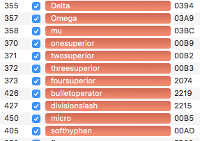

# Amatic SC Font Project
by Vernon Adams

Amatic SC (Small Caps) is a simple but effective hand drawn webfont.

Amatic SC can be used for titling and small runs of text.
It has been designed to be used freely across the internet by web browsers on desktop
computers, laptops and mobile devices.

This project is a fork from the old Google font repository.

# Completed tasks:

* new directory structure
* ported Amatic "in-progress" sources to glyphs files
* ran QA scripts and fixed issues

# Todo:

* Improve README.md
* Run fonts through Fontbakery and ship fonts.
* There is "BetaMatic" and "Metamatic" in the old sources, it would be nice to have them as glyphs sources as well.
* Draw missing glyphs in Bold Master: Delta, Omega, mu, micro, onesuperior, twosuperior, threesuperior, foursuperior, bulletoperator, divisionslash, softhyphen; Marked red. 

* Some of the Bold ligatures: ff* mm ll ee lack variety between glyphs, because they use the same components for the double glyphs. Marked orange. 

